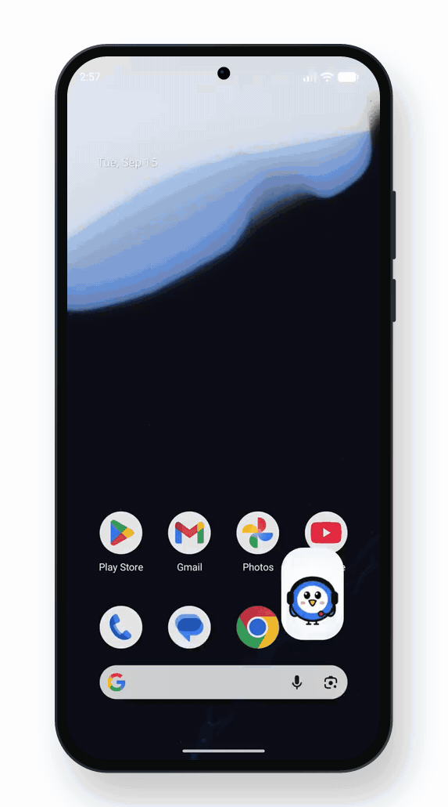
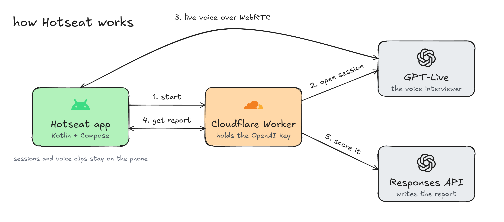

  

<h1 align="center">Hotseat</h1>

practice job interviews out loud. a voice interviewer asks, listens and follows up, then you get a report on every answer.

<a href="https://github.com/Gmin2/hotseat/releases/latest"><b>download the android apk</b></a>

  <picture>
    <source media="(prefers-color-scheme: dark)" srcset="media/demo-dark.gif">
    
  </picture>

- pick a round: behavioral, android technical, system design or one built from a job post
- talk it through, the interviewer runs a real interview pattern and digs into what you said
- tap the play button beside any question to hear it again
- when you end, you get a score, a STAR breakdown and a better way to say each answer

built with kotlin and jetpack compose on android. the voice runs on openai gpt-live over webrtc, through a small cloudflare worker that holds the key.

## how it works

  

the app asks the worker to start, the worker opens a gpt-live session with the openai key, then the phone and the interviewer talk directly over webrtc. at the end the transcript goes back through the worker to get scored.
